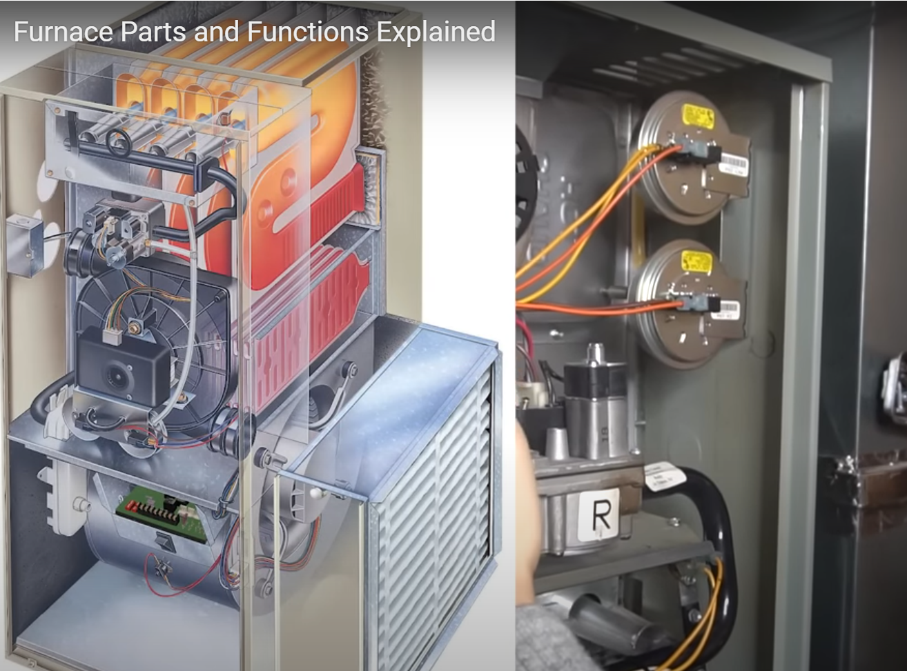

# Furnace learning

## Terms

* **AFAU** : Annual Fuel Utilization Efficiency: 年度燃料利用率
* $$Furance Efficiency= AFAU={{FuleBurned}\over{FuelConverToUseableHeat}}$$
* $${70-/80+/ 85+/90+/95+}$$

## Construction

1. Mounted on the wall or close to the wall, with a big metal sheet box. Motor, blower, controller ect are installed inside of the box.

2. A cover/door in front face of the box, which is screened, many small vent holes on it to allow cooling for the components inside.

3. The Draft blower also called

* **draft inducer blower** or
* inducer draft blower, or
* draft inducer, or
* 排烟风机 or
* 排废气风机

4. After remove the doors. (Door with a handle, push up to remove it)

5. Junction box on the side of the Box, power in from the box, with a switch can be on or off. Power in from this box

6. Inducer draft motor, pull draft gas/air though the burner and the heat exchanger to heat the air and move to the outside of the house。

7. Normally do not just replace the motor, instead, to replace the whole blower assembly.

8. The pipe can be metal or plastic

9. Single stage motor with 2 wires.

10. Behind the wall is heat exchanger, a pass waved.

11. Blower fan to cycle the room air.

12. Pressure switch. 2 stage need 2 switch, each connect to the blower housing though a rubber pipe. When the blower on, the inlet and out pipe with pressure difference and cause the pressure switch close, and the power line to apply voltage of the burner to igniter the fire with the gas, and allow it works. This is a safety device. If blower does not work, if the performance weak, will cause the pressure deference drop and open the switch, it will cause the current cut off and stop burner work.

13. Thermal protector, to prevent the burner became too hot.

14. Flames switch, on the conner of the box.

15. Gas ratio valve, controlled by PCBA.

16. Burner。 3 or 4 generally depend on the BTU needed

17. Igniter.

18. Flame sensor.

## Process

1. Power on

2. Inducer drafter blower on and running

3. Pressure switch on

4. The igniter on

5. The control allow the gas valve on

6. The gas in + air in, pulled by drafter inducer blower

7. Burner and heat the heat exchanger

8. Drafter inducer blower pull the draft air up to the pipe and then to the outside of the house.

9. The fan blower on, pull the room air inside the furnace and though heat exchanger to became hot, and then push to inside of the house and circulate the air

10. once the blower in condition and the pressure switch open, the power off, the gas value close, and the igniter off.

11. once the flame sensor detected no flame, the gas valve will close, and alarm

12. once the heat exchanger became too hot, the thermal sensor will find and the control board will close the gas valve and igniter.

13. once the flame get out of the heat exchanger, the flame switch will close and close the gas valve.

