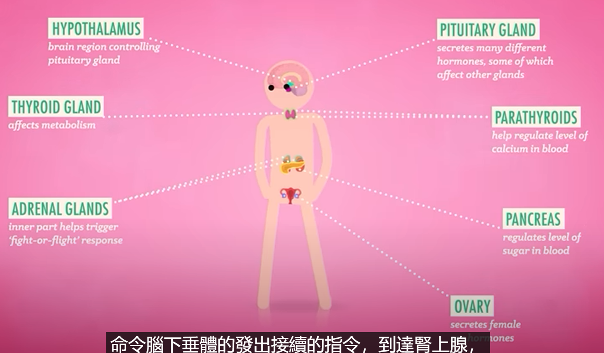

# 心理学 Psychology
[Lecture](https://www.youtube.com/watch?v=vo4pMVb0R6M&list=PL8dPuuaLjXtOPRKzVLY0jJY-uHOH9KVU6&index=2)
## History

* 佛洛依德
* 结构主义
* 功能主义
* 精神分析学
* 心理动力理论
* 认知心理学
* 神经心理学
* 社会心理学
* 行为心理学
* 教育心理学
* 神经科学
* 脑科学
* 神经工程
* 脑机接口

* 过度自信
* 自然观察法
* 调查+访谈
* 双盲实验

[Next](https://www.youtube.com/watch?v=vHrmiy4W9C0&list=PL8dPuuaLjXtOPRKzVLY0jJY-uHOH9KVU6&index=5) _2024-12-29_